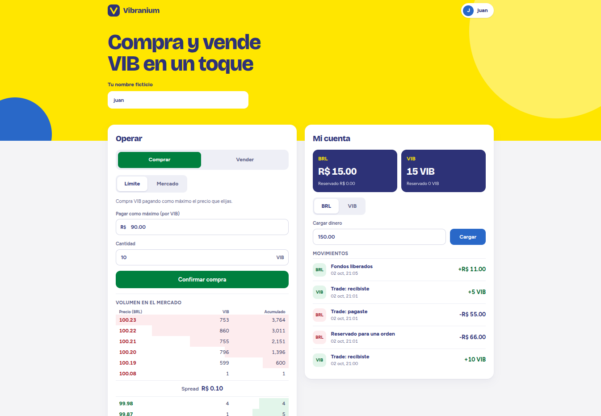
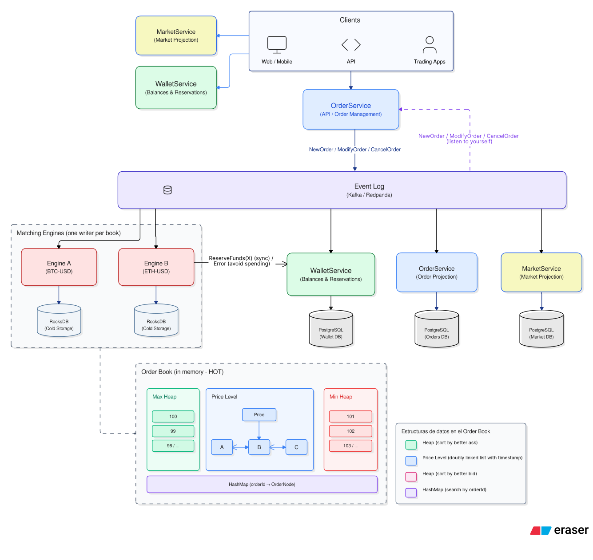

# Vibranium Exchange

Un exchange para comprar y vender Vibranium (VIB) con reales (BRL). Las personas ponen órdenes de compra y de venta, y un **order book** las cruza por precio y después por orden de llegada. Está construido como microservicios en Go ([Gofr](https://gofr.dev)) que se comunican por un **log de eventos** (Redpanda, API de Kafka), y se despliega en Kubernetes con Helm.

Los requerimientos de producto están en el [PDR](docs/PDR/order-book-vibranium.md) y la API en [docs/api.md](docs/api.md).

## Qué hace

- **Wallet:** cada persona, identificada por un nombre ficticio en el header `X-User-ID`, carga BRL y VIB, retira BRL, y ve sus saldos y movimientos.
- **Órdenes:** compras y ventas **limit** (con precio máximo o mínimo) y **market** (al mejor precio disponible). Se pueden cambiar o cancelar mientras siguen abiertas.
- **Cruce:** el engine cruza la mejor compra con la mejor venta, al precio de la orden que ya estaba en el book. Una persona nunca cruza consigo misma: si la siguiente contraparte es propia, se cancela lo que falta de la orden que llega.
- **Fondos:** la wallet congela los fondos de cada orden antes de que entre al book, paga cada trade entre comprador y vendedor, y libera lo que no se usó.
- **Mercado:** la profundidad del book es pública y está agregada por precio, sin mostrar órdenes ni personas.
- **Web:** la página de la portada permite operar y ver la wallet, el libro y las órdenes propias.

## Arquitectura



La regla central es que **cada book tiene un solo escritor**: un matching engine que aplica todos sus comandos en un orden total. Las órdenes de distintas personas llegan al mismo tiempo, pero el engine las procesa de a una, en el orden del log. Distintos books se escalan en paralelo, con un engine cada uno.

### Componentes

| Componente | Roles | Qué hace | Guarda |
| --- | --- | --- | --- |
| **OrderService** | `api` | Recibe crear, cambiar y cancelar; publica cada uno como comando en `orders.commands` y responde cuando el log lo confirmó | nada |
| | `projector` | Lee los comandos y los eventos del engine, y mantiene el estado de cada orden | `order_service` |
| **Matching engine** | uno por book | Lee la partición de su book, reserva fondos, cruza y publica lo que pasó en `orders.events` | el book, en memoria |
| **WalletService** | `api` | Saldos, depósitos, retiros y movimientos | `wallet_service` |
| | `funds` | `funds:batch`: reserva y libera los fondos de un lote de órdenes, a pedido del engine. Es interno, sin ruta en el ingress | `wallet_service` |
| | `trades` | Lee los trades y paga cada uno a comprador y vendedor | `wallet_service` |
| **MarketService** | — | Lee los cambios de cada nivel de precio y sirve la profundidad del book | `market_service` |
| **client** | — | Sirve la página web, que llama a la API pública | nada |
| **Redpanda** | — | El log: `orders.commands` y `orders.events`, una partición por book, sin borrar nada | el log |
| **PostgreSQL** | — | Una base por servicio. Ningún servicio lee la base de otro | |

Un ingress expone todo en un solo host: `/orders`, `/wallet` y `/market` van a su servicio y `/` a la página. La consola de Redpanda queda en su propio host.

### El viaje de una orden

1. `POST /orders` llega a OrderService, que publica `NewOrder` en `orders.commands`, en la partición de su book, y responde `201` con la orden en `PENDING`.
2. El engine de ese book lee los comandos en lotes de lo que haya disponible, hasta 500. Le pide a WalletService, con una sola llamada a `funds:batch`, que congele los fondos de todas las órdenes nuevas del lote.
3. Aplica los comandos en el orden del log: cruza, cancela o modifica, y libera en la wallet lo que ya no hace falta, como el remanente de una market o la diferencia cuando una compra paga menos que su límite.
4. Publica en `orders.events` lo que pasó: `OrderAccepted` u `OrderRejected`, `TradeExecuted`, `OrderCancelled`, `OrderModified` y `OrderBookLevelChanged`.
5. Tres lectores aplican esos eventos en su base, también en lotes:
   - el `projector` actualiza el estado y lo ejecutado de cada orden;
   - el rol `trades` paga cada trade;
   - MarketService guarda el nuevo estado de cada nivel de precio.

Del paso 2 en adelante todo es asíncrono. Una orden sin fondos queda `REJECTED` con su motivo, y lo recibido en un trade aparece en la wallet milisegundos después del cruce.

### El order book en memoria

Cada lado del book (compras y ventas) tiene:

- **un heap de precios** (max-heap para las compras, min-heap para las ventas), para encontrar el mejor precio sin recorrer la lista;
- **un nivel por precio**, con sus órdenes en orden de llegada, para cruzar por precio y después por tiempo;
- **un mapa de `orderId` a su nodo**, para cancelar o modificar una orden sin buscarla.

El book vive en memoria. Al arrancar, el engine lo reconstruye releyendo su partición de `orders.commands` desde el principio, sin mover fondos ni publicar otra vez lo que ya publicó.

### Decisiones que sostienen todo

- **El log es la fuente de verdad.** Los comandos se guardan para siempre, y el engine y las proyecciones pueden reconstruirse desde ahí.
- **Al menos una vez, con efecto una vez.** Un mensaje puede llegar dos veces, así que cada lector es idempotente:
  - el `id` de cada evento sale del comando que lo produjo, así que un reintento publica los mismos ids;
  - el ledger de la wallet no acepta dos veces el mismo movimiento;
  - cada actualización de una orden lleva su condición en el `WHERE`.
- **Lotes.** El engine reserva los fondos de un lote en una llamada, y cada lector aplica su lote con una sola llamada a PostgreSQL y una sola confirmación en el log.
- **Sin deadlocks en la wallet.** Las reservas del engine y los pagos de trades tocan los mismos saldos, así que los dos bloquean las filas siempre en el mismo orden (por persona y moneda).
- **Dinero en enteros.** Los montos son `int64` en la unidad mínima de cada moneda (centavos de BRL, VIB enteros) y viajan como strings decimales (`"90.00"`), nunca como números de punto flotante.

### Lo que muestra el diagrama y todavía no existe

- **RocksDB y snapshots del book:** hoy el engine reconstruye el book releyendo todo el log, y tarda más mientras más largo es el log.
- **Varios books:** el sistema está preparado para un engine por book, pero hoy hay uno solo configurado, `BRL-VIB`.

## Estructura del repo

```text
go.mod                 un solo módulo de Go para todo el repo
microservices/<x>/     un servicio cada uno: main.go, handlers/, store/, models/, migrations/
shared/                contratos entre servicios: dinero, books, errores, identidad y el log (eventlog/)
deploy/                charts de Helm (orderbook, postgres), docker-compose para desarrollo y scripts
tools/loadgen/         generador de carga y medición de punta a punta
docs/                  API, PDR, benchmark del engine e imágenes
openspec/              specs y changes: cada cambio de comportamiento se propone ahí antes de programarlo
```

Cada servicio separa sus capas: un paquete por entrada en `handlers/` (una ruta HTTP o un lector del log), el acceso a datos en `store/` y los tipos de dominio en `models/`. Las reglas de arquitectura y de código están en [.claude/standards](.claude/standards).

## Correrlo

Necesita minikube con el addon de ingress, Helm, kubectl y Docker.

```bash
minikube start
minikube addons enable ingress

deploy/up.sh                                           # construye las imágenes e instala todo desde cero
echo "$(minikube ip) orderbook.local console.orderbook.local" | sudo tee -a /etc/hosts
```

`deploy/up.sh` borra la instalación anterior y sus volúmenes: cada corrida empieza con las bases y el log vacíos. Al terminar quedan:

| URL | Qué es |
| --- | --- |
| <http://orderbook.local> | la página web |
| `http://orderbook.local/orders`, `/wallet`, `/market` | la API ([docs/api.md](docs/api.md)) |
| <http://console.orderbook.local> | Redpanda Console: topics, mensajes y lag de cada consumer group |

Para medir carga de punta a punta, mira [tools/loadgen](tools/loadgen/README.md):

```bash
tools/loadgen/run.sh -rate 5000 -duration 1m
```

## Desarrollo

Se trabaja con TDD y specs: un cambio de comportamiento empieza como un change en `openspec/`, y no hay código de producción sin un test que falle primero.

```bash
docker compose -f deploy/docker-compose.yml up -d   # PostgreSQL y Redpanda para desarrollar
go test ./...                                       # unit tests, como CI
go test -tags integration ./...                     # contra el PostgreSQL de compose
gofmt -l . && go tool gocyclo -over 9 .             # formato y complejidad (deben salir vacíos)
```

Cada paquete con lógica mantiene al menos 85 % de cobertura.

## Rendimiento

La meta del PDR es sostener 5.000 órdenes por segundo en un book.

- **El engine solo**, en memoria y sin la wallet ni el log: entre ~135.000 y ~210.000 comandos/s según el perfil ([docs/benchmark.md](docs/benchmark.md)).
- **De punta a punta en minikube**, en una laptop:
  - la API acepta 5.000 órdenes/s con p99 de ~30–50 ms;
  - el engine sigue el ritmo los primeros ~10 s y después baja a ~2.700–2.900 órdenes/s, unas 3.600/s en promedio;
  - los lectores llegan a lag 0 pocos segundos después de que el engine termina.

Lo que queda por resolver es el ciclo de cada lote del engine: reservar, cruzar, liberar y publicar, uno detrás de otro. El siguiente paso es medir cuánto tarda cada uno.
