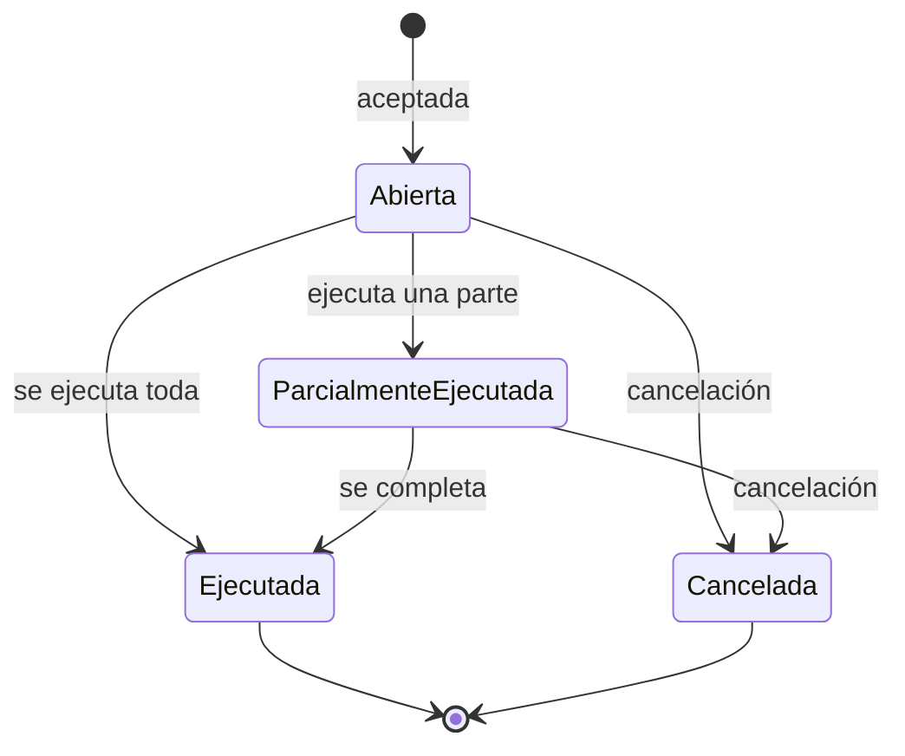

# PRD – Order Book Vibranium (MVP)

> Versión: 0.1 · Fecha: 2026-09-30 · Estado: borrador

## Índice

1. [Contexto y problema](#1-contexto-y-problema)
2. [Objetivos y alcance](#2-objetivos-y-alcance)
3. [Glosario y reglas de negocio](#3-glosario-y-reglas-de-negocio)
4. [Historias: persona y wallet](#4-historias-persona-y-wallet)
5. [Historias: órdenes](#5-historias-órdenes)
6. [Historias: ejecución y liquidación](#6-historias-ejecución-y-liquidación)
7. [Historias: historial](#7-historias-historial)
8. [Requerimientos no funcionales](#8-requerimientos-no-funcionales)
9. [Supuestos y preguntas abiertas](#9-supuestos-y-preguntas-abiertas)

---

## 1. Contexto y problema

Necesitamos construir una API de order book donde las personas compren y vendan Vibranium (VIB) pagando en reales (BRL), con precios fijados por la oferta y la demanda de los propios participantes.

Hoy no existe un lugar donde quien quiere vender VIB y quien quiere comprarlo se encuentren con reglas claras y justas. Sin un libro de órdenes central, cada negociación es bilateral, el precio es opaco y nadie garantiza que la contraparte tenga los fondos.

El MVP resuelve tres cosas:

- **Encuentro justo:** el sistema cruza automáticamente la mejor oferta de compra con la mejor oferta de venta, en orden de precio y luego de llegada.
- **Confianza en la liquidación:** los fondos se congelan al crear la orden, así que ninguna ejecución puede fallar por falta de saldo ni gastar dos veces el mismo dinero.
- **Trazabilidad:** cada persona puede ver qué se ejecutó de cada orden, a qué precio y en qué cantidad.

El único par operable es **VIB/BRL**: el precio de VIB siempre se expresa en reales. El producto se entrega solo como API; no hay interfaz gráfica.

## 2. Objetivos y alcance

El MVP está listo cuando una persona puede fondear su wallet, operar BRL/VIB con órdenes market y limit, y ver cada ejecución, con 5.000 operaciones por segundo y sin perder nada confirmado ante una caída.

### Métricas de éxito

| Métrica | Meta |
| --- | --- |
| Throughput sostenido | 5.000 operaciones por segundo |
| Doble gasto | 0 casos |
| Descuadre de saldos (suma total por moneda antes vs. después de operar, sin contar depósitos y retiros) | 0 |
| Operaciones confirmadas perdidas tras una caída | 0 |
| Ejecuciones a un precio peor que el límite de la persona | 0 |

### Dentro del alcance

- API para personas, wallets (depósitos y retiros), órdenes y ejecuciones.
- Un solo par: BRL/VIB.
- Órdenes market y limit, de compra y de venta.
- Modificación y cancelación de órdenes.

### Fuera del alcance

- Interfaz gráfica o app móvil.
- Autenticación y autorización (la persona se identifica con su ID en la petición).
- Pasarelas de pago reales: depósitos y retiros son simulados solo en BRL.
- Comisiones.
- Otras monedas o pares (la arquitectura debe permitir a futuro hacer esto).
- Expiración de órdenes, stop-loss y otros tipos de orden.
- Datos de mercado públicos (profundidad del libro, velas, ticker).

## 3. Glosario y reglas de negocio

Estas reglas aplican a todas las historias; cada historia las referencia en lugar de repetirlas.

### Glosario

| Término | Significado |
| --- | --- |
| Libro de órdenes | Conjunto de órdenes limit abiertas, separadas en compras (bids) y ventas (asks). |
| Orden limit | Orden con precio máximo (compra) o mínimo (venta). Lo que no se ejecuta queda en el libro. |
| Orden market | Orden que se ejecuta de inmediato al mejor precio disponible. Nunca queda en el libro. |
| Orden en reposo (maker) | Orden limit que ya estaba en el libro. |
| Orden entrante (taker) | Orden que acaba de llegar y busca contraparte. |
| Ejecución (fill) | Cruce entre una compra y una venta: cantidad de VIB y precio en BRL. |
| Saldo disponible | Parte de la wallet que la persona puede usar para nuevas órdenes o retiros. |
| Saldo reservado (congelado) | Parte de la wallet comprometida con órdenes abiertas. No se puede usar para nada más. |

### Reglas

1. **Unidades.** VIB se opera solo en unidades enteras (mínimo 1). BRL usa 2 decimales. El precio es BRL por 1 VIB, con 2 decimales y mayor que cero.
2. **Congelar al crear.** Al aceptar una orden, el sistema congela (pasa de disponible a reservado) lo máximo que podría necesitar. Ese saldo congelado no puede usarse en otra orden, en otro libro ni en un retiro hasta que la orden se ejecute o se cancele:
    1. Compra limit: cantidad × precio máximo, en BRL.
    2. Compra market: el monto en BRL indicado.
    3. Venta limit o market: la cantidad de VIB.
3. **Sin saldo, sin orden.** Antes de congelar se valida el saldo disponible: en limit, la cantidad y el precio máximo (o mínimo) que fija la persona; en market, el monto en BRL a gastar (compra) o los VIB a vender (venta). Si el disponible no alcanza, la orden se rechaza completa y no se crea.
4. **Prioridad precio-tiempo.** Primero se ejecuta el mejor precio (la compra más alta, la venta más baja). A igual precio, la orden que llegó primero.
5. **Precio de ejecución.** Una ejecución ocurre al precio de la orden en reposo. Así, quien llega con un límite mejor que el del libro recibe el precio más favorable.
6. **Mejora de precio.** Si una compra limit se ejecuta por debajo de su límite, la diferencia congelada vuelve al disponible en ese mismo momento.
7. **Market es inmediata.** Una orden market ejecuta lo que el libro permita y cancela el resto. Si no hay contraparte, se cancela sin ejecuciones.
8. **Sin auto-cruce.** Una orden nunca se ejecuta contra otra de la misma persona. Si la próxima contraparte es propia, el remanente de la orden entrante se cancela; las ejecuciones ya hechas se mantienen.
9. **Liberación al cerrar.** Cuando una orden termina (ejecutada, cancelada o remanente cancelado), todo lo congelado que no se usó vuelve al disponible.
10. **Vigencia.** Una orden limit vive hasta ejecutarse por completo o ser cancelada. No expira.
11. **Sin comisiones.** Cada ejecución mueve exactamente cantidad × precio en BRL y la cantidad en VIB.

### Estados de una orden

| Estado | Significado | ¿Está en el libro? |
| --- | --- | --- |
| Abierta | Aceptada, sin ejecuciones. | Sí (solo limit) |
| Parcialmente ejecutada | Tiene ejecuciones y aún le queda cantidad. | Sí (solo limit) |
| Ejecutada | Toda su cantidad se ejecutó. | No |
| Cancelada | La canceló la persona o el sistema (market sin liquidez, auto-cruce). Puede tener ejecuciones previas. | No |

Una orden rechazada por validación o falta de saldo no llega a existir: la API devuelve el error y no queda registro de orden.

Una orden market sigue el mismo camino en un solo instante: ejecuta lo que puede y termina en Ejecutada o Cancelada, sin quedar en el libro.

## 4. Historias: persona y wallet

Cada persona tiene exactamente una wallet, con saldo disponible y reservado por moneda (BRL y VIB).

### HU-01 · Registrar una persona

**Como** operador de la plataforma, **quiero** registrar una persona, **para** que pueda tener una wallet y operar.

**Por qué:** sin una identidad no hay a quién asignar saldos, órdenes ni ejecuciones.

**Criterios de aceptación**

- Al registrarla, el sistema devuelve un ID único de persona.
- Se crea automáticamente su wallet con BRL y VIB en cero (disponible y reservado).
- Todas las demás operaciones reciben ese ID en la petición. Un ID inexistente se rechaza con un error claro.

### HU-02 · Consultar mi wallet

**Como** persona, **quiero** ver mi saldo por moneda, **para** saber cuánto puedo usar y cuánto está comprometido en órdenes.

**Por qué:** si la persona no distingue lo disponible de lo congelado, no entiende por qué se le rechaza una orden.

**Criterios de aceptación**

- Muestra, para BRL y para VIB: disponible, reservado y total (disponible + reservado).
- El saldo refleja inmediatamente cualquier orden creada, ejecutada, modificada o cancelada.
- Ningún saldo es negativo, nunca.

### HU-03 · Depositar reales o Vibranium

**Como** persona, **quiero** acreditar BRL o VIB en mi wallet, **para** tener fondos con qué comprar o activos que vender.

**Por qué:** el libro necesita compradores con reales y vendedores con Vibranium desde el día uno. El depósito es simulado: no hay pasarela real.

**Criterios de aceptación**

- Se indica moneda (BRL o VIB) y monto positivo. VIB solo en unidades enteras; BRL con hasta 2 decimales.
- El monto se suma al saldo disponible.
- Un reintento de la misma petición (misma clave de idempotencia) no acredita dos veces.
- Cada depósito queda registrado con fecha, moneda y monto.

### HU-04 · Retirar reales

**Como** persona, **quiero** retirar BRL de mi wallet, **para** sacar mis ganancias o fondos no usados.

**Por qué:** una persona que no puede sacar su dinero no confía en la plataforma. El retiro es simulado.

**Criterios de aceptación**

- Solo BRL. Un retiro de VIB se rechaza (fuera del MVP).
- Solo se puede retirar del saldo disponible. El saldo congelado en órdenes no se puede retirar.
- Si el monto supera el disponible, se rechaza completo; no hay retiros parciales.
- Un reintento con la misma clave de idempotencia no debita dos veces.
- Cada retiro queda registrado con fecha y monto.

## 5. Historias: órdenes

La persona crea, consulta, modifica y cancela sus órdenes; toda orden aceptada congela su saldo antes de buscar contraparte (reglas 2 y 3).

### HU-05 · Comprar VIB con orden limit

**Como** persona, **quiero** comprar una cantidad de VIB fijando el precio máximo que estoy dispuesta a pagar, **para** no pagar más de lo que considero justo.

**Por qué:** la limit protege a quien compra de movimientos de precio; a cambio, puede no ejecutarse de inmediato.

**Criterios de aceptación**

- La persona indica cantidad de VIB (entero ≥ 1) y precio máximo en BRL.
- Se valida que el BRL disponible cubra cantidad × precio máximo; si no, se rechaza sin crear la orden.
- Si se acepta, ese monto queda congelado y la orden busca contraparte de inmediato (HU-12).
- Nunca se ejecuta a un precio mayor que el máximo. Si se ejecuta más barato, la diferencia vuelve al disponible (regla 6).
- Lo que no se ejecuta queda en el libro como Abierta o Parcialmente ejecutada.
- La respuesta devuelve el ID de la orden, su estado y las ejecuciones ocurridas al crearla.

*Ejemplo:* tengo R$ 1.000 disponibles y pido 10 VIB a máximo R$ 90. Se congelan R$ 900. Hay 4 VIB en venta a R$ 85: compro 4 por R$ 340, recupero R$ 20 de mejora de precio y quedan 6 VIB en el libro con R$ 540 congelados.

### HU-06 · Vender VIB con orden limit

**Como** persona, **quiero** vender una cantidad de VIB fijando el precio mínimo que acepto, **para** no vender por debajo de lo que considero justo.

**Por qué:** es la contraparte natural de HU-05 y la que aporta oferta al libro.

**Criterios de aceptación**

- La persona indica cantidad de VIB (entero ≥ 1) y precio mínimo en BRL.
- Se valida que el VIB disponible cubra la cantidad; si no, se rechaza sin crear la orden.
- Si se acepta, esa cantidad de VIB queda congelada y la orden busca contraparte de inmediato.
- Nunca se ejecuta a un precio menor que el mínimo. Si hay compradores que pagan más, se vende a su precio.
- Lo que no se ejecuta queda en el libro.

### HU-07 · Comprar VIB con orden market

**Como** persona, **quiero** gastar un monto en BRL para comprar VIB al mejor precio disponible ahora, **para** entrar al mercado sin esperar.

**Por qué:** prioriza la inmediatez sobre el precio. Se expresa en BRL porque la persona piensa en cuánto quiere gastar.

**Criterios de aceptación**

- La persona indica el monto en BRL a gastar (> 0).
- Se valida que el BRL disponible cubra ese monto; si no, se rechaza sin crear la orden.
- Se congela el monto y se compra desde la venta más barata hacia arriba, solo en unidades enteras de VIB, mientras el remanente alcance para al menos 1 VIB al siguiente precio.
- Lo que no se gastó (por falta de oferta o porque no alcanza para 1 VIB más) vuelve al disponible y la orden termina (regla 7).
- Estado final: Ejecutada si se gastó todo; si no, Cancelada con las ejecuciones que tuvo.

*Ejemplo:* gasto R$ 500. Hay 3 VIB a R$ 100 y 5 VIB a R$ 110. Compro 3 por R$ 300 y 1 por R$ 110; R$ 90 no alcanzan para otro VIB y vuelven al disponible.

### HU-08 · Vender VIB con orden market

**Como** persona, **quiero** vender una cantidad de VIB al mejor precio disponible ahora, **para** salir del mercado sin esperar.

**Criterios de aceptación**

- La persona indica la cantidad de VIB (entero ≥ 1).
- Se valida que el VIB disponible cubra la cantidad; si no, se rechaza sin crear la orden.
- Se vende desde la compra más alta hacia abajo hasta completar la cantidad o agotar compradores.
- El VIB no vendido vuelve al disponible y la orden termina.

### HU-09 · Listar y consultar mis órdenes

**Como** persona, **quiero** ver mis órdenes y el detalle de cada una, **para** saber qué tengo abierto y qué pasó con lo que envié.

**Criterios de aceptación**

- Lista las órdenes de la persona, más recientes primero, con paginación.
- Permite filtrar por estado (Abierta, Parcialmente ejecutada, Ejecutada, Cancelada) y por lado (compra/venta).
- Cada orden muestra: ID, lado, tipo (market/limit), precio límite, cantidad original, cantidad ejecutada, cantidad pendiente, precio promedio ejecutado, estado y fechas de creación y última actualización.
- Una persona solo ve sus propias órdenes.

### HU-10 · Modificar precio o cantidad de una orden

**Como** persona, **quiero** cambiar el precio o la cantidad de una orden limit abierta, **para** ajustarme al mercado sin cancelar y volver a crear.

**Por qué:** ahorra pasos y evita quedar un instante sin orden en el libro.

**Criterios de aceptación**

- Solo aplica a órdenes limit en estado Abierta o Parcialmente ejecutada.
- La nueva cantidad es la cantidad pendiente deseada y debe ser ≥ 1.
- Se recalcula el saldo congelado: si se necesita más, se valida contra el disponible y, si no alcanza, la modificación se rechaza y la orden queda como estaba. Si se necesita menos, el excedente vuelve al disponible.
- **Prioridad:** reducir la cantidad conserva el lugar en la fila. Cambiar el precio o aumentar la cantidad envía la orden al final de la fila de su precio.
- Si el nuevo precio cruza con el libro, la orden se ejecuta de inmediato como en HU-12.
- Las ejecuciones previas no cambian.
- Si la orden se ejecutó antes de que llegue la modificación, se rechaza indicando el estado actual.

### HU-11 · Cancelar una orden

**Como** persona, **quiero** cancelar una orden abierta, **para** recuperar mi saldo congelado cuando cambio de opinión.

**Criterios de aceptación**

- Aplica a órdenes en estado Abierta o Parcialmente ejecutada.
- La orden sale del libro y pasa a Cancelada; lo congelado no usado vuelve al disponible.
- Las ejecuciones previas se mantienen.
- Cancelar una orden ya Ejecutada o Cancelada se rechaza indicando su estado; repetir la misma cancelación no tiene efecto adicional.
- Solo la dueña de la orden puede cancelarla.

## 6. Historias: ejecución y liquidación

El sistema cruza órdenes por precio y luego por llegada, y cada ejecución intercambia BRL y VIB entre las dos personas de forma atómica, usando solo saldo ya congelado.

### HU-12 · Cruzar la mejor compra con la mejor venta

**Como** persona que envía una orden, **quiero** que el sistema la ejecute contra las mejores órdenes del libro, **para** obtener el precio más favorable posible dentro de mi límite.

**Por qué:** el límite es el tope que la persona tolera, no el precio que quiere pagar. Si alguien ofrece algo mejor, lo justo es que lo reciba.

**Criterios de aceptación**

- Una compra cruza con una venta cuando el precio de compra es ≥ al de venta (para market, siempre que haya contraparte).
- La orden entrante recorre el libro desde el mejor precio: compras desde la venta más barata; ventas desde la compra más alta.
- Dentro de un mismo precio, se ejecuta primero la orden más antigua.
- Cada cruce se ejecuta al precio de la orden en reposo (regla 5).
- La cantidad de cada ejecución es el mínimo entre lo pendiente de ambas órdenes.
- El recorrido termina cuando la orden entrante se completa, cuando el siguiente precio ya no cumple su límite, cuando no queda contraparte o cuando la siguiente contraparte es de la misma persona (regla 8).
- Las órdenes se procesan en un orden único y determinista: la misma secuencia de entradas produce siempre las mismas ejecuciones.

*Ejemplo:* en el libro hay ventas de 2 VIB a R$ 95 (Ana), 3 VIB a R$ 95 (Beto, llegó después) y 5 VIB a R$ 98. Llega una compra limit de 6 VIB a máximo R$ 100. Resultado: 2 VIB a R$ 95 con Ana, 3 VIB a R$ 95 con Beto y 1 VIB a R$ 98. El comprador paga R$ 573 en lugar de los R$ 600 congelados; R$ 27 vuelven a su disponible.

### HU-13 · Liquidar sin doble gasto

**Como** persona que opera, **quiero** que cada ejecución mueva el dinero y el Vibranium de forma exacta e indivisible, **para** confiar en que recibo lo que me corresponde y nadie gasta dos veces el mismo saldo.

**Por qué:** es la base de la confianza. Un doble gasto o una ejecución a medias crea dinero o activos de la nada.

**Criterios de aceptación**

- En cada ejecución de Q VIB a precio P:
    - El comprador pierde Q × P BRL de su reservado y gana Q VIB en su disponible.
    - El vendedor pierde Q VIB de su reservado y gana Q × P BRL en su disponible.
- Los cuatro movimientos ocurren todos o ninguno. No existe un estado intermedio visible.
- Solo se liquida con saldo ya congelado por la orden; una ejecución nunca toma saldo disponible.
- Un mismo saldo congelado no puede respaldar dos órdenes a la vez, ni en este libro ni en otro.
- Lo recibido por una ejecución queda disponible de inmediato para nuevas órdenes o retiros.
- La suma total de BRL y de VIB en el sistema no cambia por operar; solo cambia con depósitos y retiros.
- Operaciones simultáneas de la misma persona (dos órdenes, una orden y un retiro) nunca dejan un saldo negativo.

## 7. Historias: historial

Cada ejecución queda registrada de forma permanente y se puede consultar por orden y por persona.

### HU-14 · Ver las ejecuciones de una orden

**Como** persona, **quiero** ver cada ejecución de una orden (cantidad y precio), **para** entender cómo se llenó y a qué precio real compré o vendí.

**Por qué:** una orden puede llenarse en varios pedazos a precios distintos; sin el detalle, la persona no puede verificar lo que pagó ni conciliar su saldo.

**Criterios de aceptación**

- Cada ejecución muestra: ID de ejecución, ID de la orden, lado, cantidad de VIB, precio, monto en BRL (cantidad × precio), si la persona fue maker o taker, y fecha y hora.
- No se muestra la identidad de la contraparte.
- Se listan en orden cronológico.
- La suma de las cantidades ejecutadas coincide con la cantidad ejecutada de la orden (HU-09).

*Ejemplo* (la compra de HU-12):

| # | Cantidad (VIB) | Precio (BRL) | Monto (BRL) |
| --- | --- | --- | --- |
| 1 | 2 | 95,00 | 190,00 |
| 2 | 3 | 95,00 | 285,00 |
| 3 | 1 | 98,00 | 98,00 |

### HU-15 · Ver todas mis operaciones

**Como** persona, **quiero** ver todas mis ejecuciones, depósitos y retiros, **para** reconstruir cómo llegó mi wallet a su saldo actual.

**Criterios de aceptación**

- Lista ejecuciones, depósitos y retiros de la persona, más recientes primero, con paginación y filtro por rango de fechas.
- A partir del historial completo se puede recalcular el saldo total actual de BRL y de VIB.
- Los registros son inmutables: no se editan ni se borran.

## 8. Requerimientos no funcionales

El sistema debe sostener 5.000 operaciones por segundo y, tras cualquier caída, volver exactamente al último estado confirmado.

| ID | Requerimiento | Qué se espera | Por qué |
| --- | --- | --- | --- |
| RNF-01 | Throughput | 5.000 operaciones por segundo sostenidas. Cuenta como operación cada creación, modificación o cancelación de orden. | Volumen esperado de mercado para el MVP. |
| RNF-02 | Durabilidad | Cero pérdida de lo confirmado: toda respuesta exitosa de la API (orden, ejecución, depósito, retiro) sobrevive a una caída. | Una ejecución confirmada que desaparece es pérdida de dinero para alguien. |
| RNF-03 | Recuperación | Al reiniciar, el libro, las órdenes y los saldos se reconstruyen idénticos al último estado confirmado, sin intervención manual. | Resiliencia a fallos pedida en el requerimiento. |
| RNF-04 | Sin estados a medias | Una caída durante una ejecución deja la ejecución completa o inexistente, nunca parcial. | Evita doble gasto y descuadres (HU-13). |
| RNF-05 | Idempotencia | Toda operación que modifica estado acepta una clave de idempotencia; un reintento con la misma clave devuelve el resultado original sin repetir el efecto. | Si la respuesta se pierde por la caída, el cliente reintenta sin crear órdenes ni depósitos duplicados. |
| RNF-06 | Consistencia | Un saldo consultado nunca es negativo y siempre cumple total = disponible + reservado. | Base de la confianza en la wallet. |
| RNF-07 | Determinismo | El mismo orden de entradas produce siempre el mismo libro y las mismas ejecuciones. | Permite auditar y reconstruir el estado. |
| RNF-08 | Auditabilidad | Todo movimiento de saldo se puede rastrear a un depósito, retiro o ejecución. | Conciliación y soporte ante reclamos. |
| RNF-09 | Errores claros | Cada rechazo indica el motivo (saldo insuficiente, orden no encontrada, estado inválido, dato inválido). | Una API sin interfaz necesita mensajes que el integrador entienda. |

La latencia objetivo por operación y la disponibilidad esperada (tiempo máximo de indisponibilidad al recuperarse) no están definidas; ver preguntas abiertas.

## 9. Supuestos y preguntas abiertas

### Supuestos

- BRL usa 2 decimales y el precio de VIB se expresa con 2 decimales.
- Se puede depositar VIB, pero no retirarlo.
- Sin autenticación: el ID de persona viaja en la petición y la API confía en él. Esto requiere una red confiable y debe resolverse antes de exponer la API.
- El libro de órdenes no se publica (ni profundidad ni último precio); cada persona solo ve lo suyo.
- La ejecución ocurre al precio de la orden en reposo (estándar de mercado).

### Preguntas abiertas

- [ ] ¿Hay cantidades o montos mínimos y máximos por orden, o un paso mínimo de precio (tick)?
- [ ] ¿Cuál es la latencia objetivo por operación (por ejemplo, p99 en milisegundos)?
- [ ] ¿Cuánto tiempo puede estar caído el servicio mientras se recupera?
- [ ] ¿Se necesita que la persona consulte el libro público o el último precio para decidir sus órdenes?
- [ ] ¿Hay límite de órdenes abiertas por persona?
- [ ] ¿Se debe retirar también VIB, o solo BRL?
- [ ] ¿La persona debe recibir notificaciones (webhook) cuando se ejecuta su orden, o basta con consultar?
